 Portrait | Teacher | URL
------- | ----- | -------------
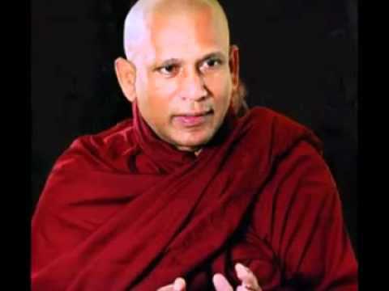 | Gangodawila Soma Thero | [http://www.trekmentor.org/content/savaka/10590](http://www.trekmentor.org/content/savaka/10590)
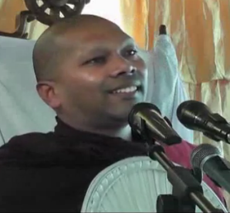 | Handapangoda Niwathaapa Thero | [http://dharmayaiobai.org](http://dharmayaiobai.org)
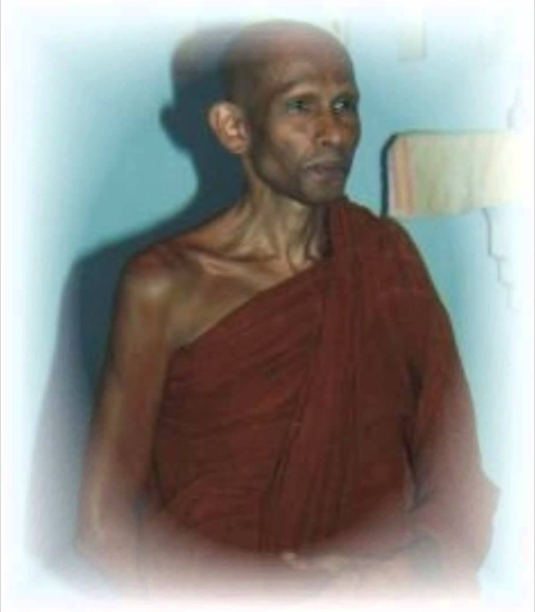 | Katukurunde Nyanananda Thero | [http://seeingthroughthenet.net/](http://seeingthroughthenet.net/)
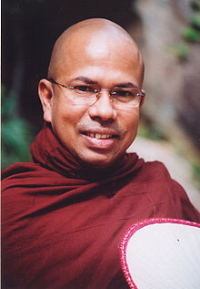 | Kiribathgoda Gnanananda Thero | [https://mahamevnawa.lk/](https://mahamevnawa.lk/)
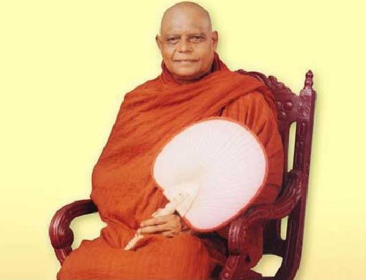 | Nauyane Ariyadhamma Thero | [http://www.ariyamagga.org/](http://www.ariyamagga.org/)   [http://www.nauyana.org/](http://www.nauyana.org/)
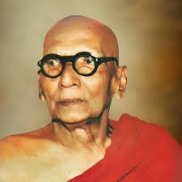 | Rerukane Chandawimala Maha Nayaka Thero | [http://ogatharana.org/](http://ogatharana.org/)
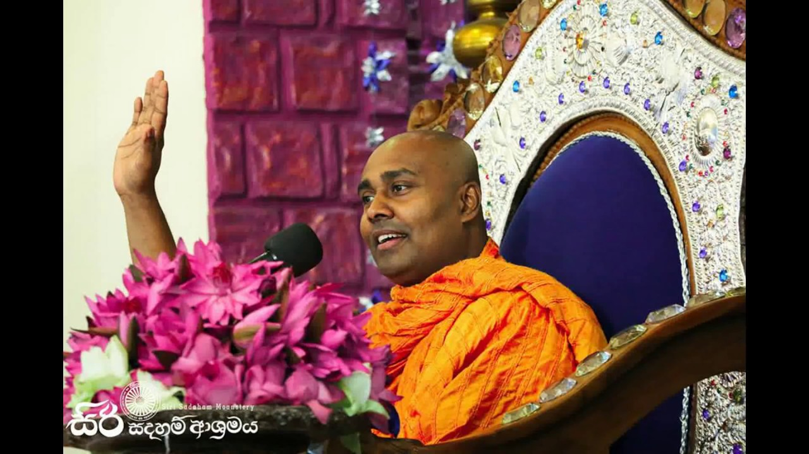 | Siri Samanthabhadra Thero | [www.ashramaya.org](www.ashramaya.org)
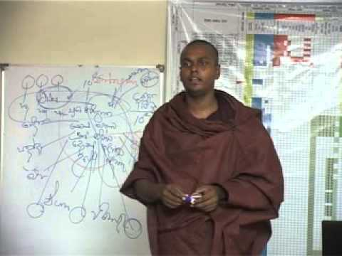 | Thiththagalle Anandasiri Thero | [http://mmbbss.com/](http://mmbbss.com/)   [Abhidharma lessons (youtube)](https://youtu.be/Bt9O4eZEUtQ)
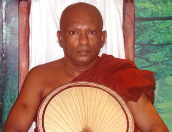 | Waharaka Abayarathanalankara Thero | [https://waharaka.com/](https://waharaka.com/)   [http://aaryadharma.org/](http://aaryadharma.org/)
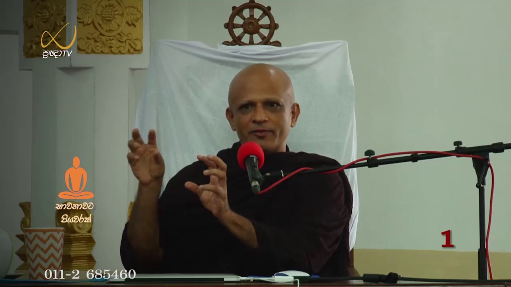 | Walasmulle Abaya Thero | [http://www.nirapekshathwayemaga.com/](http://www.nirapekshathwayemaga.com/)
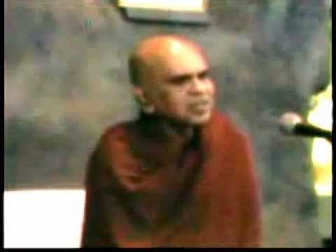 | ? | [http://www.maharahathunwadimaga.com/](http://www.maharahathunwadimaga.com/)
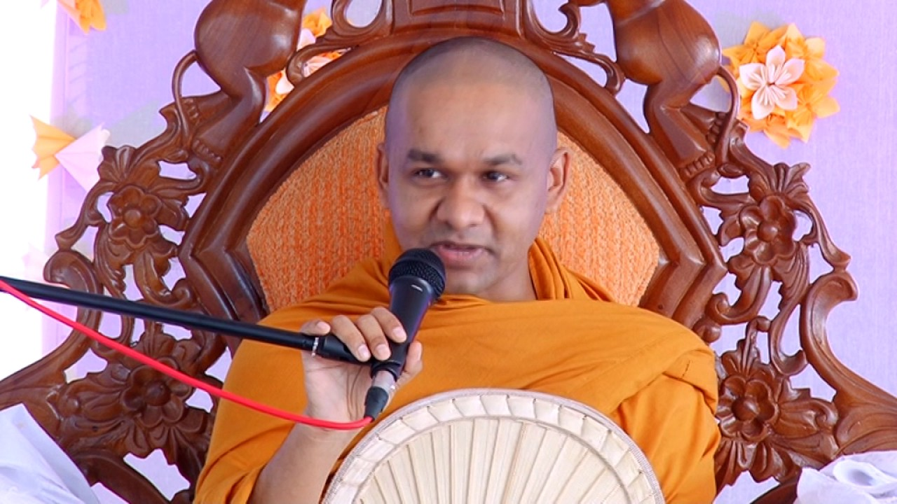 | Ven Mawarale Bhaddiya Thero | ?
 | Ajahn Brahm Thero | [https://bswa.org/teachers/ajahn-brahm/](https://bswa.org/teachers/ajahn-brahm/)

## Books
[https://www.online.buddhistcc.com/](https://www.online.buddhistcc.com/)

## Monasteries
Arankale 
[Kanduboda](http://insight-meditation.org/) 
Ritigala

## Resources
[https://pitaka.lk/](https://pitaka.lk/)  
[http://www.aathaapi.org/](http://www.aathaapi.org/)  
[http://thripitaka.org/](http://thripitaka.org/)
[http://download.ifbcnet.org/](http://download.ifbcnet.org/)

## YouTube Channels
